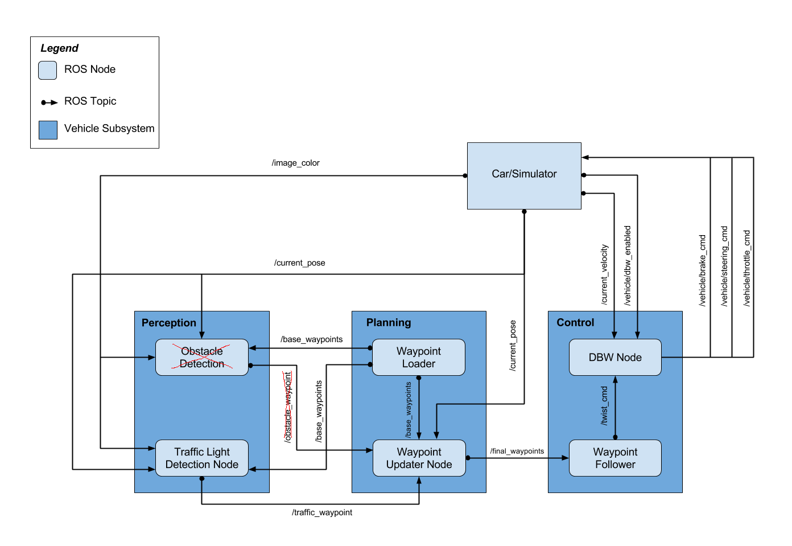
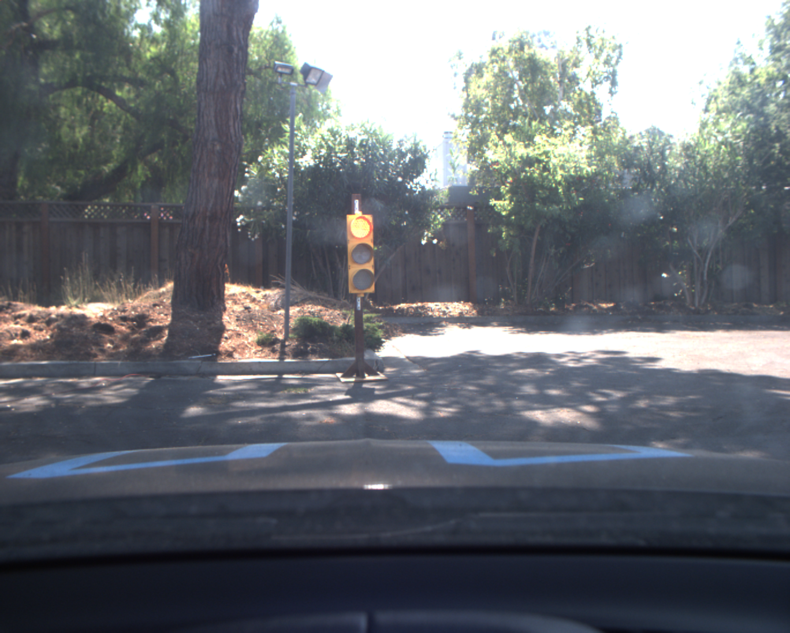
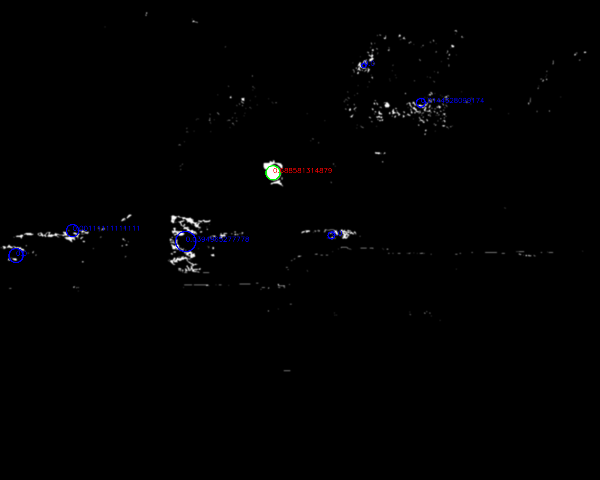
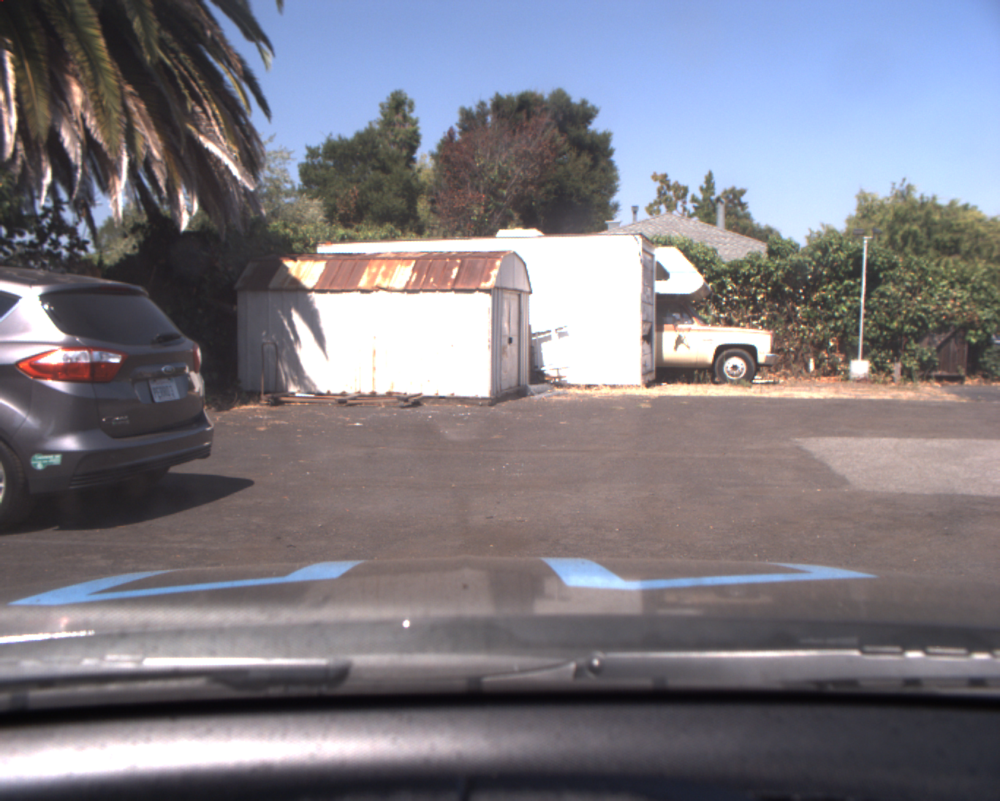
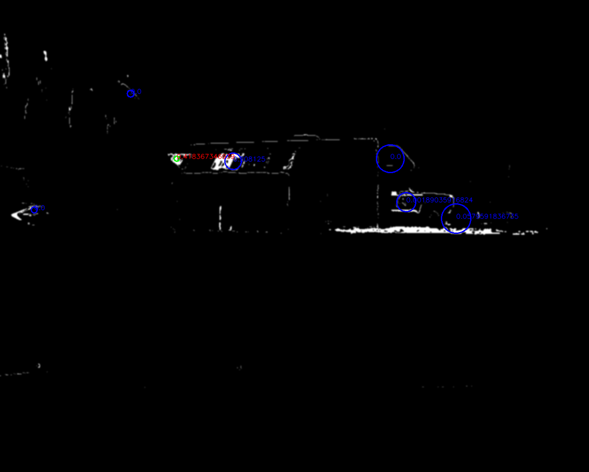
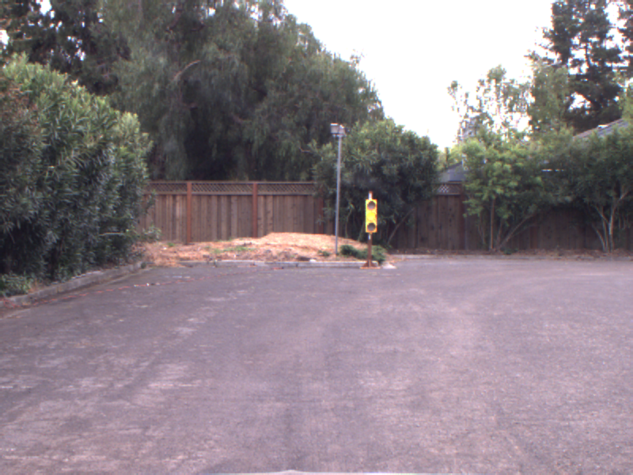
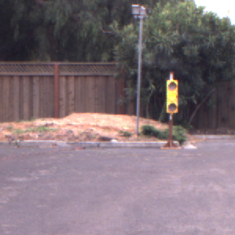

## System Integration Project

This is the project repo for the final project of the Udacity Self-Driving Car Nanodegree: Programming a Real Self-Driving Car. For more information about the project, see the project introduction [here](https://classroom.udacity.com/nanodegrees/nd013/parts/6047fe34-d93c-4f50-8336-b70ef10cb4b2/modules/e1a23b06-329a-4684-a717-ad476f0d8dff/lessons/462c933d-9f24-42d3-8bdc-a08a5fc866e4/concepts/5ab4b122-83e6-436d-850f-9f4d26627fd9).


### Team: Experienced Drivers

| Name                    | Email                       |
| ----------------------- | --------------------------- |
| Xiang Jiang (Team Lead) | jx.for.jiangxiang@gmail.com |
| Ahmed Khatib            | ackhatib@gmail.com          |
| William Wu              | willywu2001@hotmail.com     |
| Haribalan Raghupathy    | haribalan.r@gmail.com       |
| Ilkka Huopaniemi        | ilkka.huopaniemi@gmail.com  |


### Implementation details

We have been following the software architecture specified by the course. However we noticed that the `Obstacle Detection` module has been removed and therefore no `/obstacle_waypoint` has been published or subscribed.



#### Overview
The starter repo has provided the skeleton of this architecture and all the ROS node has been provided with starter file. There are three ROS nodes in this diagram that we need to work on.

They are:

- Waypoint Updater Node
- DBW Node
- Traffic Light Detection Node

I will describe how we implement each of these node below.


#### Waypoint updater

We update only the [waypoint_updater.py](https://github.com/khatiba/CarND-System-Integration/blob/master/ros/src/waypoint_updater/waypoint_updater.py)

Waypoint updater node will publish waypoints from the from the car's current position to some waypoints ahead.
It will publish to `final_waypoints`.

Waypoint updater node subscribe to:
- `/current_pose` This contains current position of the car.
- `/base_waypoints` This contains the planned route of the car.
- `/current_velocity` This contains current velocity of the car.
- `/traffic_waypoints` This contains information about whether there is a red light ahead or there is no red light closeby.

Apart from those already mentioned in the udacity course.
Two functions are where we spend most of time developing on.
###### pose_cb
This is the callback function when we receive the current position of the car.
Whenever we receive a new position of the ego-car, we will check the corresponding waypoints of it.
If it is different from the previous one, we will publish the new waypoints.
If it is the same, for performance purpose, we avoid sending duplicate data.
This has an excpetion where if car is trying to resuming from stopped state, we will publish updated waypoints even when our position stays the same.

###### traffic_cb
This is the callback function when we receive the closest red light wayppints.
If the value is -1 meaning no red light nearby, we will publish the received `/base_waypoints`.
If there is a visible red light ahead of us, we would need to bring the car to stop and resuming when the light turns green.

We achieve both **stopping** and **resuming** by setting waypoint velocity.
For **stopping** we gradually slow the car down by setting the velocity from current position to stop line linearly decreasing to zero.
To make sure it does not overshoot we set extra_brake_wps so that if the car overshoot by accident it will still try to stop.

For **resuming** we gradually bring the car back to the pre-configured target velocity set by the launch file. We will set the waypoint velocity value to it linearly increasing it from 0 to target velocity.

Some flags like `self.stopping` and `self.resuming` are present to carry the current state of the car.


#### DBW (Drive-By-Wire)

We update [dbw_node.py](https://github.com/khatiba/CarND-System-Integration/blob/master/ros/src/twist_controller/dbw_node.py) and [twist_controller.py](https://github.com/khatiba/CarND-System-Integration/blob/master/ros/src/twist_controller/twist_controller.py).

###### dbw_node.py
DBW node took in target twist command and publish the driving command: throttle, brake and steer.

This is the main class of the DBW node. It subscribe to:
- `/vehicle/dbw_enabled` whether DBW is enabled
- `/current_velocity` current velocity
- `/twist_cmd` target twist command including linear and angular velocity

It publishes to `/vehicle/steering_cmd` `/vehicle/throttle_cmd` `/vehicle/brake_cmd`.

Not much value added in this file by us here except we instantiate a controller that took in the subscribed information and outputs steering, throttle and break. 

The hardwork is in the twist_controller.py that contains the controller code.

###### twist_controller.py
Here we instantiates four extra controllers.
`accel_controller` is a PID controller to estimate the target acceleration.
`lowpass_filter` is a Low Pass Filter to smooth out the acceleration calcuated by the `accel_controller`.
`yaw_controller` is a Yaw Controller to calculate the target steering based on target and current twist command.
`throttle_controller` is another PID controler that took in acceleration output from the `lowpass_filter` and estimate the actual throttle needed.
We reset the `throttle_controller` when acceleration is not positive. 
If acceleration is negative, we calculate brake based on vehicle status specified by input controller.


#### Traffic Light Detection

We updated [tl_detector.py](https://github.com/khatiba/CarND-System-Integration/blob/master/ros/src/tl_detector/tl_detector.py) and added [cv_method.py](https://github.com/khatiba/CarND-System-Integration/blob/master/ros/src/tl_detector/light_classification/cv_method.py)

**Resubmission notes: **
 [cv_method.py](https://github.com/khatiba/CarND-System-Integration/blob/master/ros/src/tl_detector/light_classification/cv_method.py) did not work for Carla driving. Reason being the filtering if too dependent on the lighting condition and would change a lot due to weather.
We have not switched back to our original NN method.
This will be described in later section and code in [carla.py](https://github.com/khatiba/CarND-System-Integration/blob/master/ros/src/tl_detector/light_classification/carla.py)

###### tl_detector.py
This is the main class of Traffic light detection node.
Traffic Light detection node subscribe to:
- `/current pose` current position of the car
- `/base_waypoints` planned route
- `/vehicle/traffic_lights` positions of all traffic_lights
- `/image_color` current image in color

Basically it detects if there is a visible red light ahead or not. 
It will publish its finding to `/traffic_waypoint`.

We have been mainly working on the `process_traffic_lights` function.
Here we firstly computed the position of all the lights and stopping line before it.
Then for each updated current position, we check if there is any upcoming traffic light within 60 waypoints distance.
If so we call up the **traffic light classifier function** to tell us the color.
If it is RED, we pass it through STATE_COUNT_THRESHOLD and publish it to the waypoint updater node through `/traffic_waypoint`.

The **traffic light classifier function** is to take in an image and tell if there is a red traffic light in it. 
We have been trying out both Neural Network based or classical vision based algorithms.
We have decided to use classical vision method.
The reason is due to the fact that we have been using the VM provided by the course and it does not have enough computation resources to run NN in tensor flow on real-time.
We have working NN that is able to detect the light correctly, but by the time it is done, the car has already driven past the traffic light.

This leads to our classical vision method using openCV functions.
It is implemented in [cv_method.py](https://github.com/khatiba/CarND-System-Integration/blob/master/ros/src/tl_detector/light_classification/cv_method.py)

###### ~~cv_method.py~~
The idea behind our algorithm is to detect a red filled circle within an image.
We use `cv2.HoughCircles` to achieve it, however there are more things to consider here.
The source of this method is from this blogpost Reference: https://solarianprogrammer.com/2015/05/08/detect-red-circles-image-using-opencv/

It is able to detect red colored circle.
The algorithm described in the blogpost is able to detect red circle in simulator.
However it is not the case for ROSBAG real-life image.

There are some problems.
1. Color is different in real life due to lighting.
     The color threshold set for simulator is almost perfect red. While in ROSBAG it is very bright and closer to orange.
     **Solution:** we have added separate `cv2.inRange` function to cater both the real life and simulator.


2. HoughCircles does not care if a circle is filled or not.
     HoughCirlces are circles detection but we need the circle to be filled for red light detection. This leads to a lot of false positive as well.
     **Solution:** After HoughCircles returns a list of circles, I applied a cv2.countNonZero to see how filled it is, if it is below certain value, it is not counted as a detected light. Notice in the image below, only the green circle is the circle that is filled and counted as a red light.

     |                 Original                 |                 Detected                 |
     | :--------------------------------------: | :--------------------------------------: |
     |  |  |


3. Also in ROSBAG, the environment, due to the sunlight, has a lot of bright red spot that has exactly same color as the traffic light. This creates a lot of false positives.
     **Solution:** STATE_CHANGE_THRESHOLD is increased to 5 so that we can allow more false positives. Also I increase minimum distance between two circles in HoughCircles function so that false positives that clustered together can be eliminated. Notice below some false positive even after the filled ratio threshold will still be unavoidable.

     |                 Original                 |                 Detected                 |
     | :--------------------------------------: | :--------------------------------------: |
     |  |  |

4. Another problem we have seen is in simulator, it the traffic light changes to red right before we pass stop line, we might not be able to stop the car on time. 
    **Solution:** I have deliberately increase the threshold to detect yellow color as well. So the car can be made aware it is going to be RED soon and slow down in advance.
    As a result: in our project loginfo, we will output only two scenarios when we publish upcoming red light after state_count_thresholding. They are:
    [RED or YELLOW]
    vs
    [GREEN or UNKNOWN]
    As shown in the image below.
    

###### **carla.py**
Due to hardware constraints on our end, we did not use NN earlier. As CV method is proven to be not working perfectly, we switched back to NN method.
We have been re-using a pre-trained model from [tensorflow detection model zoo](https://github.com/tensorflow/models/blob/master/research/object_detection/g3doc/detection_model_zoo.md).
We picked [ssd_mobilenet_v1_coco](http://download.tensorflow.org/models/object_detection/ssd_mobilenet_v1_coco_2017_11_17.tar.gz) since it is the fastest.

This model is trained w.r.t. COCO dataset where there traffic_light is a class. So by passing an image into the network, boxes are returned to indicate object detected and type of the object.
It is a SSD on a mobilenet structure.

Inputs are 300x300 for the network.
So we provided 6 regions of interest with size 300x300, assuming our images are 600x800.


We loop over the 6 ROI and feed it into the NN.
If a traffic light is detected, we will stop searching for this frame to save time.

| Original                           | Grid                           | Light                            |
| ---------------------------------- | ------------------------------ | -------------------------------- |
|  |  |  |

Once a traffic light has been boxed. We will convert the cropped image to HSV like the cv_method.

Looking at the V value, we filter the very bright pixels and get an average height of it.

We also filter out the very dark pixels and get an average height of it.

If light is on top and darkness is at bottom, then it is a red light.

```python
        brightness = cv2.cvtColor(traffic_light, cv2.COLOR_BGR2HSV)[:,:,-1]
        light_h,light_w = np.where(brightness >= (brightness.max() - 5))
        light_h_mean = light_h.mean()
        dark_h,dark_w = np.where(brightness <= (brightness.max() - 50))
        dark_h_mean = dark_h.mean()
        total_h = traffic_light.shape[0]
        combined_h = (light_h_mean + (total_h - dark_h_mean))/2
        light_ratio = combined_h / total_h
        if light_ratio < 0.53: # A larger value to include most of YELLOW as RED
            return TrafficLight.RED
        elif light_ratio > 0.60:
            return TrafficLight.GREEN
        else:
            return TrafficLight.YELLOW

```
Vice versa for green light.

So this method is color-blind friendly as it assumes the traffic light setup is vertical and always RED on top.

For same reason stated in cv_method, I try to treat YELLOW as RED to be cautious so we slow down at yellow light.


#### Summary

With the above implementation details, we have successfully run the our algorithm in both simulator and ROSBAG files.
After state_count_thresholding there should be no unnessary stopping of the vehicle.

The cv_method might not be very robust if the lighting condition changes when running on Carla.
Due to the limitation of hardware, this is the best of what we have here.


### Instructions

Please use **one** of the two installation options, either native **or** docker installation.

#### Native Installation

* Be sure that your workstation is running Ubuntu 16.04 Xenial Xerus or Ubuntu 14.04 Trusty Tahir. [Ubuntu downloads can be found here](https://www.ubuntu.com/download/desktop).
* If using a Virtual Machine to install Ubuntu, use the following configuration as minimum:
  * 2 CPU
  * 2 GB system memory
  * 25 GB of free hard drive space

  The Udacity provided virtual machine has ROS and Dataspeed DBW already installed, so you can skip the next two steps if you are using this.

* Follow these instructions to install ROS
  * [ROS Kinetic](http://wiki.ros.org/kinetic/Installation/Ubuntu) if you have Ubuntu 16.04.
  * [ROS Indigo](http://wiki.ros.org/indigo/Installation/Ubuntu) if you have Ubuntu 14.04.
* [Dataspeed DBW](https://bitbucket.org/DataspeedInc/dbw_mkz_ros)
  * Use this option to install the SDK on a workstation that already has ROS installed: [One Line SDK Install (binary)](https://bitbucket.org/DataspeedInc/dbw_mkz_ros/src/81e63fcc335d7b64139d7482017d6a97b405e250/ROS_SETUP.md?fileviewer=file-view-default)
* Download the [Udacity Simulator](https://github.com/udacity/CarND-Capstone/releases).

#### Docker Installation
[Install Docker](https://docs.docker.com/engine/installation/)

Build the docker container
```bash
docker build . -t capstone
```

Run the docker file
```bash
docker run -p 4567:4567 -v $PWD:/capstone -v /tmp/log:/root/.ros/ --rm -it capstone
```

#### Port Forwarding
To set up port forwarding, please refer to the [instructions from term 2](https://classroom.udacity.com/nanodegrees/nd013/parts/40f38239-66b6-46ec-ae68-03afd8a601c8/modules/0949fca6-b379-42af-a919-ee50aa304e6a/lessons/f758c44c-5e40-4e01-93b5-1a82aa4e044f/concepts/16cf4a78-4fc7-49e1-8621-3450ca938b77)

#### Usage

1. Clone the project repository
```bash
git clone https://github.com/khatiba/CarND-System-Integration.git
```

2. Install python dependencies
```bash
cd CarND-System-Integration
pip install -r requirements.txt
```
3. Make and run styx
```bash
cd ros
catkin_make
source devel/setup.sh
roslaunch launch/styx.launch
```
4. Run the simulator

#### Real world testing
1. Download [training bag](https://s3-us-west-1.amazonaws.com/udacity-selfdrivingcar/traffic_light_bag_file.zip) that was recorded on the Udacity self-driving car.
2. Unzip the file
```bash
unzip traffic_light_bag_file.zip
```
3. Launch your project in site mode
```bash
cd CarND-Capstone/ros
roslaunch launch/site.launch
```
4. Play the bag file
```bash
rosbag play -l traffic_light_bag_file/just_traffic_light.bag
```
​    and
```bash
rosbag play -l traffic_light_bag_file/loop_with_traffic_light.bag
```

5. Confirm that traffic light detection works on real life images
